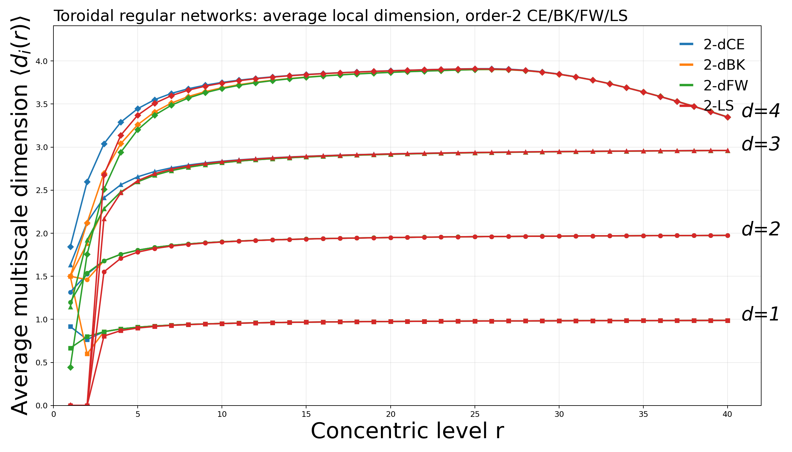
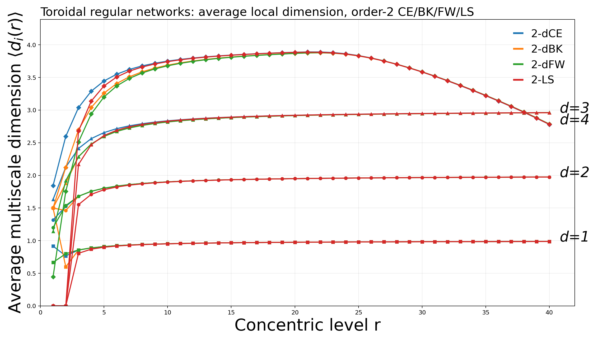

# Toroidal Regular Networks: Multiscale Dimension Analysis

## Scope
This note documents how Helios measures multiscale network dimension on toroidal regular networks and summarizes large-scale benchmark results for order-2 estimators:

- `2-dCE` (central difference, order 2)
- `2-dBK` (backward difference, order 2)
- `2-dFW` (forward difference, order 2)
- `2-LS` (local least squares, order 2)

The experiments were run on 1D, 2D, 3D, and 4D toroidal regular networks.

## Dimension Definitions
Let `G=(V,E)` be a graph and `dist(i,j)` the geodesic distance (shortest-path length).

### 1) Concentric Ball Volume
For node `i` and radius `r`:

`V_i(r) = | { j in V : dist(i,j) <= r } |`

This is the cumulative number of nodes within `r` hops from node `i`.

### 2) Local Multiscale Dimension
The local dimension at node `i` and scale `r` is the log-log slope of growth:

`d_i(r) = d(ln V_i(r)) / d(ln r) = (r / V_i(r)) * (dV_i(r)/dr)`

### 3) Global Multiscale Dimension
Define the average ball volume:

`<V(r)> = (1/|V|) * sum_i V_i(r)`

Then global multiscale dimension:

`D(r) = (r / <V(r)>) * (d<V(r)>/dr)`

In regular homogeneous networks, `D(r)` and the node-average `<d_i(r)>` are typically close.

## Estimators Used (Order 2)
The derivative term is estimated on discrete radii.

### `2-dFW` (Forward Difference, order 2)
`dV/dr ~= -3/2 V(r) + 2V(r+1) - 1/2 V(r+2)`

### `2-dBK` (Backward Difference, order 2)
`dV/dr ~= +3/2 V(r) - 2V(r-1) + 1/2 V(r-2)`

### `2-dCE` (Central Difference, order 2)
`dV/dr ~= (2/3)(V(r+1)-V(r-1)) - (1/12)(V(r+2)-V(r-2))`

### `2-LS` (Local Least Squares, order 2)
Local linear regression of `ln V(h)` vs `ln h` in window `h in [r-2, r+2]`, slope is `d_i(r)`.

## Why very low sampling is acceptable here
For toroidal regular networks, nodes are topologically equivalent (translation symmetry).  
So sampling very few reference nodes (for example `2`) is enough to estimate `<d_i(r)>` reliably.

## Latest Large Run (10x preset, `sample_nodes=2`, `max_level=40`)

Preset used:
- 1D: `1310720`
- 2D: `1414 x 1414` (`1,999,396` nodes)
- 3D: `104 x 104 x 104` (`1,124,864` nodes)
- 4D: `50 x 50 x 50 x 50` (`6,250,000` nodes)

Observed maxima of average local dimension (`max <d_i(r)>`):

| Dimension | 2-dCE | 2-dBK | 2-dFW | 2-LS |
|---|---:|---:|---:|---:|
| `d=1` | 0.988 | 1.500 | 0.988 | 0.988 |
| `d=2` | 1.975 | 1.975 | 1.975 | 1.975 |
| `d=3` | 2.961 | 2.960 | 2.960 | 2.961 |
| `d=4` | 3.910 | 3.901 | 3.903 | 3.908 |

Notes:
- `2-dBK` overshoots in `d=1` at small radii (`~1.5`), expected from backward stencil behavior.
- For `d=2,3,4`, all four methods are close in this toroidal setting.

## Plots

### 10x run (`r <= 40`)


### 5x run (`r <= 40`)


## How to Run

### 1) Prepare environment
```bash
source /opt/miniconda3/etc/profile.d/conda.sh
conda activate helios-dim313
```

### 2) Run tests (Python binding + dimension checks)
```bash
python -m pytest -q python/tests/test_network.py
```

### 3) Generate order-2 CE/BK/FW/LS plot
```bash
MPLCONFIGDIR=$PWD/.mplconfig \
python python/examples/toroidal_methods_order2_plot.py \
  --ten-x \
  --sample-nodes 2 \
  --max-level 40 \
  --output python/examples/toroidal_order2_method_average_tenx_r40.png
```

Other useful presets:
- `--large`
- `--xlarge`
- `--xxlarge`
- `--five-x`
- `--ten-x`

Each mode can be combined with:
- `--sample-nodes N`
- `--max-level R`
- `--output <path>`
